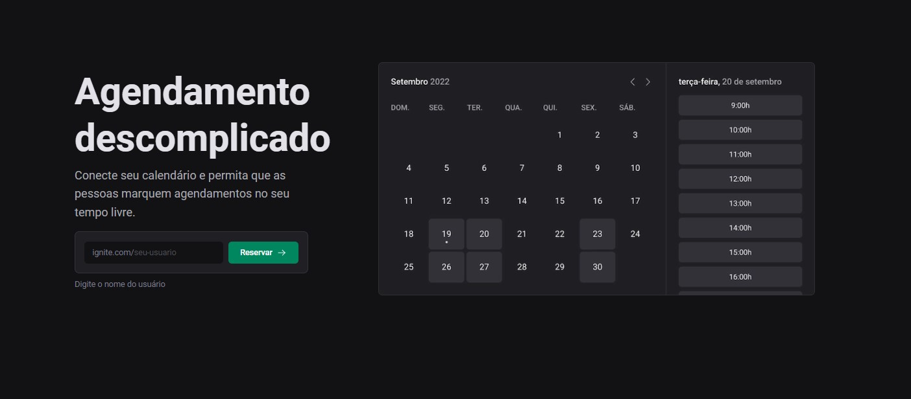
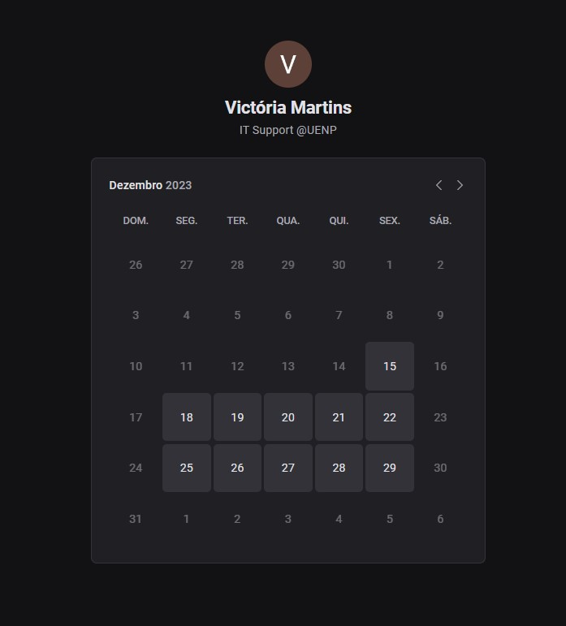

# ignite-call

Ignite Call was developed during the last module of the Ignite Bootcamp. It's a scheduling tool that integrates with Google Calendar.

## Web Interface

Home page:

Scheduling page: 

## Tools, technologies & libs

- Next
- Next auth
- Dayjs
- Axios
- Google APIs
- Zod
- React Hook Form 
- Typescript
- Prisma